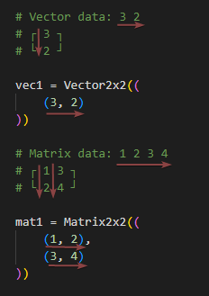

Lilial — linear algebra in Python? Easy!
========================================

The most important rule of the bot is that we write not as we read. What did I mean by that? Matrices and vectors are read first from top to bottom, and then from left to right. But in this library, the order is different — we write first from left to right, and then from top to bottom

